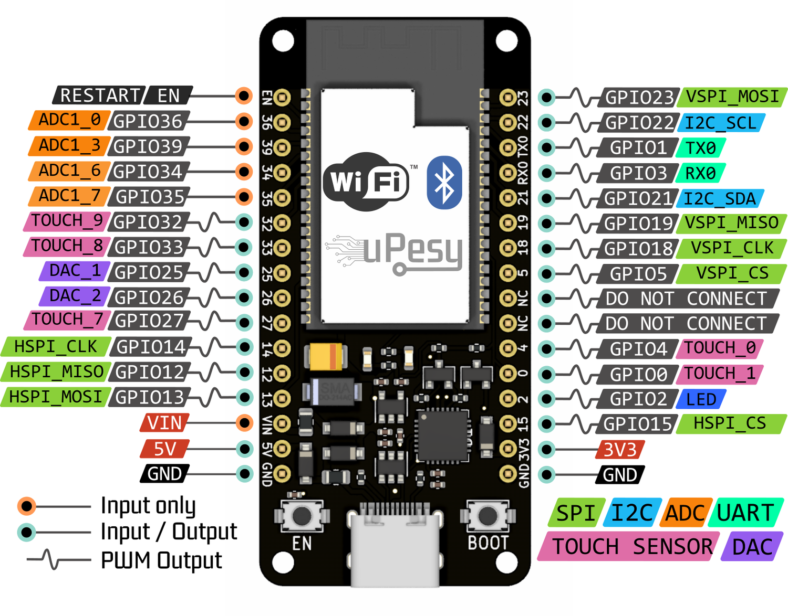
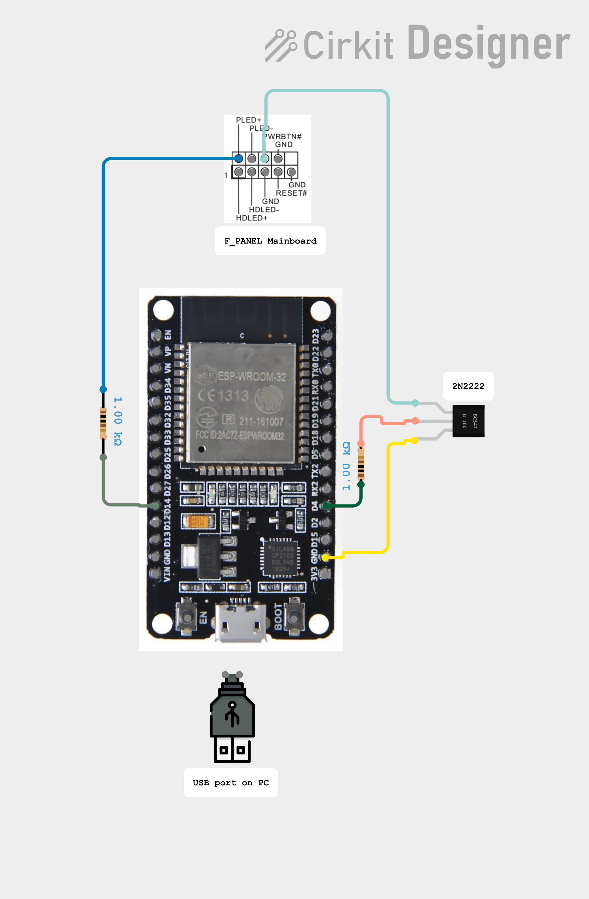
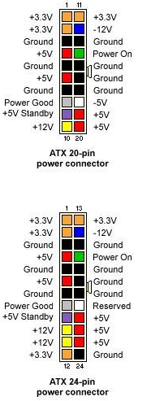

# ESPHome PC Power Control via Home Assistant esp32 wroom

This project contains remote PC power control via HomeAssistant and ESPHome ESP8266/ESP32 boards.

I use this project to power my PC based NAS remotely on and off via Home Assistant as alternative to Wake-On-Lan (WOL) which has known limitations.

## Features

* Control physical PC power button (front panel) connected to the motherboard:
  * Turn PC power on from any power state such as `power-off/suspended/hybernate` (Behavior short press power button).
  * Graceful `shutdown/suspend/hybernate` of the operating system (Behavior short press power button).
  * Force power-off (Behavior long press power-button).
* Read PC power on/off status from motherboard.
* No operating system dependency.
* Power/reset buttons front panel remains full functional.
* User authorization via Homeassistant.
* Use with any (micro/mini)-ATX computer motherboard.

Original idea Youtube video:

[](https://www.youtube.com/watch?v=rAcvqaPf830)

Homeassistant screenshot:


## Differences Wake-On-Lan (WOL) magic packet

[Wake-On-Lan (WOL)](https://en.wikipedia.org/wiki/Wake-on-LAN) is intended to turn computer power on remotely via Ethernet by sending a so called `magic packet`. This has several known limitations which are not applicable with this ESP project:

* Wake-On-Lan (WOL) has **no authorization**! The WOL protocol has no functionality to provide a password or allow a specific computer to wake from. Any device on the same LAN can wake a PC by sending a magic packet. The ESP is password protected via Homeassistant.
* Wake-On-Lan (WOL) can only `wake` a PC from suspend or power-off state. There is no shutdown/suspend functionality. 
* To put a Linux machine in `sleep` state, a SSH connection to the remote PC can be made for example by executing `pm-suspend` command (Install via `sudo apt install pm-utils`), reference [Ubuntu pm-action documentation](https://manpages.ubuntu.com/manpages/jammy/man8/pm-action.8.html). Disadvantages:
  * Requires SSH login.
  * Requires sudo rights.
* Wake-On-Lan magic packets are ignored when connecting main power the first time to the power supply, even when WOL is activated in the BIOS. The reason is that WOL is disabled on most computers at first power on and requires activation by a running operating system before the PC responds on a magic packet to wake the computer. Reference: [Ubuntu Wake-On-Lan](https://help.ubuntu.com/community/WakeOnLan).
* Running Homeassistant [Wake-On-Lan](https://www.home-assistant.io/integrations/wake_on_lan) in a Docker container cannot forward broadcast magic packets with a bridged network configuration. It requires an external Docker container as bridge to forward magic packages and is beyond the scope of Homeassistant. This is currently not included in Homeassistant documentation.

## Hardware

The hardware consists ESP32 and two IO pins.
* One pin controls the power button by generating a long or short press
* A second pin reads the motherboard power status.

## Schematic

**ESP32 Information**



**2N2222 Transistor pin out**


**ESP32 Schematics**

Power is provided using USB-A to miniUSB cable routed from one of the outside USB ports to the inside of the case.
Most mainboards have USB always on nowadays to support wake on keyboard/mouse.



**ATX power from 20/24 pin ATX connector from PSU:**

You can also use +5vSB from ATX mainboard connector, if  you want to. 
Or, as in the original project, the USB 2.0 mainboard header.
Many new mainboards do not include the USB 2.0 header on board anymore.

## ATX 20/24 pin out



**ATX header USB 2.0:**

Alternatively, you can use Header `J1` pin 1 constant +5V power on pin 1, even when the PC is power-off.

**ATX header F_PANEL System panel:**

Header `J2` contains the power, reset and GND pins:

Some new PC cases do not provide full F_PANEL header. Only the reset and power led are populated (the top row). 
This is why I had to use the Power Led pin to sense PC status (on or off).
* Power button pin 6.
  * Short press: Turn PC on or generate graceful shutdown.
  * Long press: Generate hard power off.
* PLED pin 2, to read status
  * Used to read power status via the reset button pin:
   * High: power-on
   * Low: power-off

## Software updates

The ESPHome application firmware can be updated via USB connection (virtual serial port) or WiFi OTA (Over The Air update).

Updating the firmware via WiFi is enabled when configuring `ota` in the .yaml file. This requires a WiFi connection between host computer and ESP. OTA update does not work when the login from ESP to WiFi base station fails due to incorrect WiFi credentials. In this case an update via serial is required or via `ap` fallback as configured in the .yaml file.

## ESPHome

The ESPHome application consists of the two Yaml files. One configuration file and a second `secrets.yaml` to store passwords.

Documentation:

* [ESPHome GPIO Switch](https://esphome.io/components/switch/gpio.html)
* [ESPHome Binary Sensor](https://esphome.io/components/binary_sensor/gpio.html)

### Project configuration

Configure the following files:
- [secrets.yaml](https://github.com/Erriez/ESPHomePCPowerControlHomeAssistant/blob/master/secrets.yaml): Configure WiFi SSID and passwords  
- [pc-power-esp32.yaml](https://github.com/jTd7bPLFb/ESPHomePCPowerControlHomeAssistantESP32/blob/master/pc-power-esp32.yaml): Configure ESP32 ESPHome

Please refer to [ESPHome documentation](https://esphome.io/components/esphome.html) for more information about ESPHome YAML configuration.


### Program ESP32

Follow ESPHome Home Assistant integration instructions to program the ESP32 board.


## Home Assistant configuration

This section describes Home Assistant configuration.

### Register ESP device

* `Configuration | Integrations: Add Integration: ESPHome`
* Home Assistant should detect new ESPHome device automatically. Just follow the instructions.
* Alternativelly, you can add the device 'by hand'
  * Select hostname or IP address of the ESP device.
  * Enter password as configured in `secrets.yml` | `esphome_api_password`.

### Homeassistant | Edit Dashboard | RAW Configuration Editor

Add PC power integration to a dashboard via raw edit:

```yaml
type: grid
cards:
  - type: heading
    heading_style: title
    heading: Gaming PC
  - type: tile
    entity: binary_sensor.pc_power_pc_power_state
    name: PC status
    show_entity_picture: true
    vertical: false
    hide_state: true
  - type: tile
    entity: switch.pc_power_pc_power_toggle
    name: Power Button
  - type: tile
    entity: switch.pc_power_pc_hard_power_off
    name: Power Long Press
column_span: 1
```

## Version history

### Update 05. February 2025

Forked the original project.
Updated to use PLED+ to detect status of PC.
Updated schematics to ESP32 wiring.
Updated Home Assistant Dashboard to use the new Grid type.

### Update 11 October 2024

The ESPHome YAML file format changed with [ESPHome version 2024.6.0](https://esphome.io/changelog/2024.6.0.html#). The old format generates errors like:

```
$ esphome compile ESPHomePCPowerControlHomeAssistant/pc-power.yaml
INFO ESPHome 2024.9.2
INFO Reading configuration ESPHomePCPowerControlHomeAssistant/pc-power.yaml...
Failed config

ota.unknown: [source ESPHomePCPowerControlHomeAssistant/pc-power.yaml:27]

  'ota' requires a 'platform' key but it was not specified.

and:

Failed config

switch.gpio: [source ESPHomePCPowerControlHomeAssistant/pc-power.yaml:30]

  Pin 4 is used in multiple places.
```

In this case, please update to the new file format in this project.

### Update 13 February 2022

* The button pin timing controlled via Homeassistant scripts was not stable. The power pin control has been moved to the ESP firmware which generates a much more accurate timing.
* Renamed the following names:
  * Rename `switch.pc_power_button` to `switch.pc_power_toggle`.
  * Rename `switch.pc_power_button_long_press` to `switch.pc_hard_power_off`.
  * Rename `switch.pc_power_sense` to `switch.pc_power_state`.
